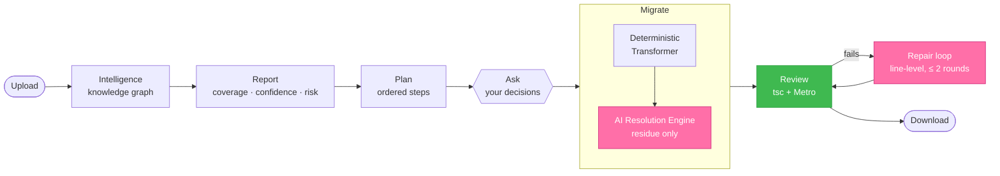
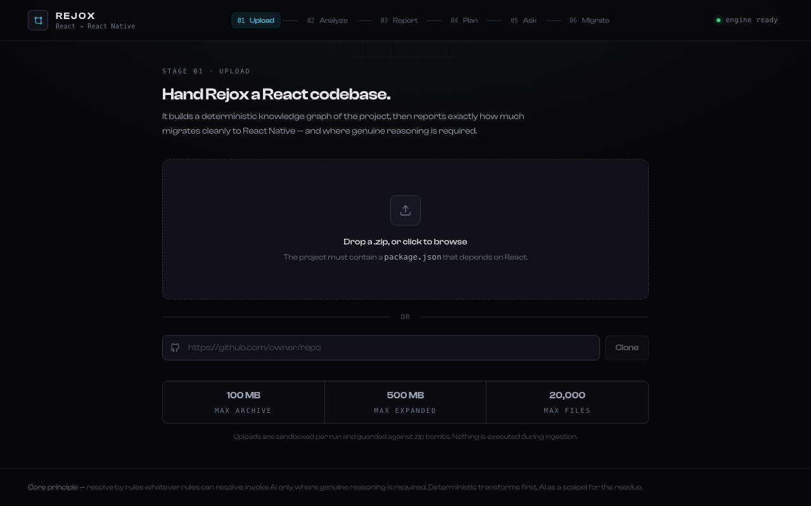
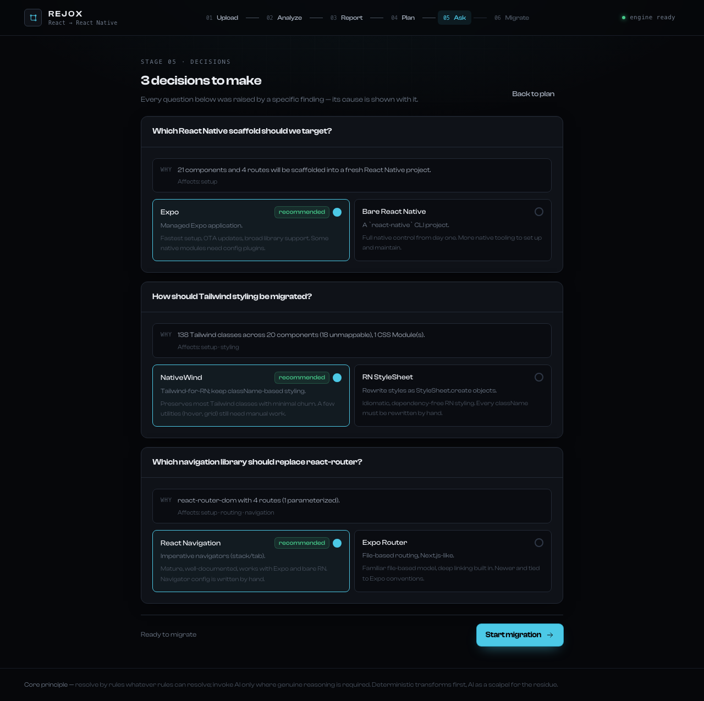

<div align="center">

<picture>
  <source media="(prefers-color-scheme: dark)" srcset="docs/assets/readme/hero-dark.svg">
  
</picture>

<br>

[](https://pypi.org/project/rejox/)
[](https://pypi.org/project/rejox/)
[](https://github.com/ashrafjr-n/REJOX/actions/workflows/ci.yml)
[](#results)
[](#what-rejox-doesnt-do-yet)
[](LICENSE)

**[Quick start](#quick-start)** · **[How it works](#how-it-works)** · **[What migrates](#what-gets-migrated)** · **[Limits](#what-rejox-doesnt-do-yet)** · **[Roadmap](#roadmap)** · **[FAQ](#faq)**

</div>

---

**Rejox is a React to React Native migration tool.** Point it at a React web app —
Vite, TypeScript or JavaScript, Tailwind CSS, React Router — and it hands back an
**Expo React Native project that type-checks and bundles**, together with a report
of everything it changed and everything that still needs a human.

It is a **CLI you install from PyPI** (`uvx rejox`), not a hosted service: your code
is read on your machine, transformed by deterministic AST codemods, and proven by
the real React Native toolchain (`tsc` + Metro) before you ever open it.

> [!NOTE]
> **Rejox is not a line-by-line converter.** It builds a knowledge graph of your
> project first, resolves by rules whatever rules can resolve, and invokes AI only
> where genuine reasoning is required. On the bundled benchmark app, a full
> migration makes **zero LLM calls**.

## Why Rejox

<table>
<tr>
<td width="50%" valign="top">

**Rules before AI**<br>
Every mapping in the [conversion table](docs/CONVERSION-RULES.md) is a
deterministic AST transform. The AI is a scalpel for the residue — one design
decision, never a whole file.

</td>
<td width="50%" valign="top">

**Proven, not claimed**<br>
Every migration is installed, type-checked with `tsc` and bundled with Metro
before Rejox calls it done. A failure is reported, never hidden.

</td>
</tr>
<tr>
<td valign="top">

**Honest numbers**<br>
Coverage is reported through two named lenses, strict first. An empty
population reports `n/a`, never a flattering `100%`.

</td>
<td valign="top">

**You stay in charge**<br>
Real design questions — Expo or bare, NativeWind or StyleSheet, tabs or stack —
are asked, with the finding that raised each one shown next to it.

</td>
</tr>
</table>

## Quick start

```bash
uvx rejox migrate ./my-react-app          # run without installing
```

or install it:

```bash
pip install rejox
rejox doctor                               # checks Node 20+, npm and the worker bundles
rejox migrate ./my-react-app               # writes ./my-react-app-native
cd my-react-app-native && npx expo start
```

**Requirements:** Python 3.11+ (uv fetches one for you) and Node 20+ on `PATH`.
Linux and macOS.

<p align="center">
  
</p>

<sub>A real run on the bundled [`sample-app`](test-projects/sample-app), replayed. Every number above comes from that run.</sub>

## How it works

Every migration flows through the same eight stages. The CLI runs stages 2–7 on
your machine; the [web app](#the-web-app) adds upload and download around them.



| Stage | What happens |
| --- | --- |
| **Intelligence** | A parser worker (ts-morph) builds a deterministic knowledge graph: components, pages, routes, stores, endpoints, styling, and how they depend on each other. |
| **Report** | The Analyzer scores **Coverage**, **Confidence** and **Risk**, and explains every point of the score. |
| **Plan** | Work is ordered into dependency waves — leaves first, then the components built from them, then pages. |
| **Ask** | Only genuine decisions reach you: scaffold, styling strategy, router replacement, navigator shape, storage. |
| **Migrate** | AST codemods convert elements, events, routing, styling, storage and env; the residue goes up a ladder: **static map → pattern → LLM**. |
| **Review** | The emitted project is installed, type-checked and bundled. Anything left is listed by file and residue code. |

## What gets migrated

| Area | React (web) | React Native (Expo) |
| --- | --- | --- |
| **Elements** | `div`, `section`, `nav`, `ul`, `form` · `p`, `span`, `h1`–`h6` · `img` · `button` · `input` | `View` · `Text` · `Image` (with `source`) · `Pressable` · `TextInput` |
| **Events** | `onClick` · `onChange` | `onPress` · `onChangeText` |
| **Routing** | `react-router-dom` routes, `<Link to>`, `<NavLink>`, `useParams` | React Navigation — a navigator generated from your route table, `navigation.navigate(…)`, `useRoute`, `useIsFocused` |
| **Tailwind** | utility classes | NativeWind `className`, untouched where it maps 1:1 |
| **Tailwind residue** | `hover:` · `grid-cols-*` · `bg-gradient-*` · `backdrop-blur` · `animate-spin` · `space-x-*` | `active:` · `flex-wrap` rows · `expo-linear-gradient` · `expo-blur` · Reanimated · `gap-*` |
| **CSS Modules** | `*.module.css` | inline `StyleSheet.create`, with `box-shadow`, `transform`, `:hover` and units translated |
| **Storage** | `localStorage` / `sessionStorage` | `AsyncStorage` (with `await` placed correctly) or MMKV — your choice |
| **Env** | `import.meta.env.VITE_X`, `.DEV`, `.PROD` | `process.env.EXPO_PUBLIC_X`, `__DEV__` |
| **Entry** | `createRoot(…).render(<Providers><App/></Providers>)` | the provider chain lifted into the generated `App.tsx` |
| **Data & state** | `axios`, `fetch`, Zustand | carried over unchanged — they run in React Native |
| **Dependencies** | every package the migrated code imports | pinned into the new project's `package.json` |

The full mapping — with a confidence level and the reasoning for every row — lives in
[`docs/CONVERSION-RULES.md`](docs/CONVERSION-RULES.md).

## What Rejox doesn't do (yet)

Rejox is deliberately narrow so that what it does, it does well. Anything below is
**flagged in the report, never silently dropped.**

- **Frameworks and renderers:** Next.js and server-side rendering, Three.js / WebGL,
  `<canvas>`, Electron.
- **State managers beyond hooks and Zustand:** Redux and Redux Toolkit are flagged as
  out of scope — their imports are carried over, not adapted.
- **Class components:** functional components and hooks only.
- **Web-only surfaces:** `<table>`, `<iframe>`, `document`, `history`, `location`,
  mouse and keyboard events. Each is listed with a residue code for a human to decide.
- **Other frameworks:** Vue, Angular and Svelte, and the reverse direction
  (React Native → web).
- **Pixel-perfect parity:** layout intent is preserved, not exact pixels.
- **Windows:** Linux and macOS today; on Windows, use WSL.

## Results

On the bundled [`sample-app`](test-projects/sample-app) — a Vite + TypeScript +
Tailwind + React Router + Zustand store app — every figure comes from a real run,
reproducible with `rejox migrate test-projects/sample-app --yes`:

| Measure | Result |
| --- | --- |
| Analysed | 21 components · 4 pages · 4 routes · 2 endpoints · 1 store |
| Predicted before migrating | Coverage **83%** · Confidence **98%** · Risk **LOW** |
| Emitted | 27 files, 13 ordered plan steps |
| LLM calls | **0** — every residue unit resolved by rule |
| `tsc` / Metro | **PASS** (0 errors) / **PASS** |
| Validated coverage — **strict** | **62%** of files migrate with nothing left to do |
| Validated coverage — compiles + bundles | **100%** of files type-check and bundle |

Two lenses, always both, strict first: *strict* counts a file only when not one
`REJOX-TODO` survives in it; *compiles + bundles* counts every file that works. One
number alone would be a choice about which truth to tell.

Beyond the benchmark, Rejox is run against real open-source React projects; what each
one found and fixed is in [`TESTING-LOG.md`](TESTING-LOG.md). CI runs the test suite
on Linux and macOS across Python 3.11–3.14 on every push, and installs the built
wheel into a clean environment to migrate the benchmark end to end.

## The web app

The same pipeline, in a browser — upload a zip or paste a GitHub URL, review the
report and the plan, answer the decisions, download the React Native project.

<table>
<tr>
<td width="50%"></td>
<td width="50%"></td>
</tr>
<tr>
<td align="center"><sub><b>Upload</b> — a zip or a GitHub URL</sub></td>
<td align="center"><sub><b>Ask</b> — every question shows the finding behind it</sub></td>
</tr>
</table>

Run it locally with `./dev.sh` ([`docs/DEVELOPMENT.md`](docs/DEVELOPMENT.md)), or
self-host it with Docker Compose — API, Redis queue and sandboxed workers
([`docs/DEPLOYMENT.md`](docs/DEPLOYMENT.md)).

## CLI reference

```
rejox migrate <project-path> [--out <dir>] [--force] [--yes] [--no-validate] [--json]
```

<details>
<summary><b>Flags</b></summary>

| Flag | Meaning |
| --- | --- |
| `--out <dir>` | Where to write the React Native project (default: `./<project>-native`). |
| `--force` | Write into `--out` even if it is not empty (files already there are kept). |
| `--yes`, `-y`, `--no-input` | Accept every recommended answer without prompting. Implied when stdin is not a terminal. |
| `--no-validate` | Skip the `tsc` + Metro validation stage (fast). |
| `--json` | Print a machine-readable summary on stdout (progress goes to stderr). Implies `--no-input`. |

`rejox --version` prints the version; `rejox --debug migrate …` shows the full
traceback if Rejox itself fails. `rejox doctor` checks the environment.

</details>

<details>
<summary><b>Exit codes</b> — stable, for scripts and CI</summary>

| Code | Meaning |
| --- | --- |
| `0` | Migrated; validation passed (or was skipped with `--no-validate`). |
| `1` | Migrated, but validation (`tsc` / Metro) failed. |
| `2` | Usage error (bad flag, missing project, non-empty `--out` without `--force`). |
| `3` | Environment: Node 20+, `npm` or a worker bundle is missing — run `rejox doctor`. |
| `4` | Input refused: the project has no React components to migrate. |
| `70` | Internal error in Rejox; re-run with `--debug` for the traceback. |

</details>

<details>
<summary><b>Environment variables</b></summary>

| Variable | Effect |
| --- | --- |
| `GEMINI_API_KEY` | Enables the real AI provider for the navigator-shape decision and the repair loop. |
| `REJOX_AI_PROVIDER=fake` | An offline, deterministic provider — for demos and CI. |
| `REJOX_WORKSPACE_ROOT` | Where run workspaces go (default `$XDG_CACHE_HOME/rejox`, i.e. `~/.cache/rejox`). |
| `REJOX_AI_CACHE` | Where the AI response cache goes. |

Nothing is ever written inside the install directory.

</details>

## AI and privacy

AI is **optional**, and Rejox is fully usable without it.

- **No key set** → AI is disabled. The navigator defaults to a stack; everything
  else is unchanged.
- **`GEMINI_API_KEY` set** → one call decides the navigator *shape* (stack, tabs or
  drawer) — the one genuine design judgment — returned as a validated spec, never
  as code.
- **If validation fails**, a repair loop may send the **offending line and its
  compiler diagnostic** — never a whole file — capped at two rounds.

Your source code is never uploaded anywhere else.

## Roadmap

- [x] CLI on PyPI — `uvx rejox`, `doctor`, `--json`, stable exit codes
- [x] Validation with the real toolchain (`tsc` + Metro) on every run
- [x] Tailwind → NativeWind, CSS Modules → `StyleSheet`, React Router → React Navigation
- [x] Web storage → AsyncStorage / MMKV, Vite env → Expo env
- [x] Python 3.11–3.14 on Linux and macOS
- [ ] Redux and Redux Toolkit
- [ ] Windows
- [ ] `npx rejox` — for React developers without Python
- [ ] A public Python API (`rejox.migrate(path)`)
- [ ] More residue resolvers — forms, responsive layouts, web-only elements

Rejox is actively developed; each release is in the [changelog](backend/CHANGELOG.md).
Missing a pattern your app needs? [Open an issue](https://github.com/ashrafjr-n/REJOX/issues)
with a minimal example — that is exactly how the conversion table grows.

## FAQ

<details>
<summary><b>Can Rejox convert my React app to React Native automatically?</b></summary>

For the patterns in the [conversion table](docs/CONVERSION-RULES.md), yes — and it
proves the result compiles and bundles. What it cannot map (a runtime `<Link to>`,
a `<table>`, a web-only event) is left as a clearly marked `REJOX-TODO` and listed
in the report. Expect a working project that still needs a human pass, not a
finished app.

</details>

<details>
<summary><b>Does it support Expo?</b></summary>

Expo is the recommended target, and the one the validation runs against: the output
is a TypeScript Expo project you start with `npx expo start`.

</details>

<details>
<summary><b>What about Tailwind CSS?</b></summary>

Tailwind classes carry over through NativeWind, untouched wherever they map 1:1.
Classes with no React Native meaning — `hover:`, `grid`, gradients, `backdrop-blur`
— are rewritten to their closest native equivalent or flagged.

</details>

<details>
<summary><b>Does it work with Next.js, Create React App or JavaScript projects?</b></summary>

Next.js and SSR are out of scope. Plain JavaScript and TypeScript React projects are
both supported — JavaScript files come out as TypeScript. Vite projects are the most
tested; Create React App projects have not been a focus yet.

</details>

<details>
<summary><b>Does my code leave my machine?</b></summary>

Only with a `GEMINI_API_KEY` set, and then only the single navigator decision and,
if the build fails, individual offending lines. See [AI and privacy](#ai-and-privacy).

</details>

## Documentation

| Document | What it covers |
| --- | --- |
| [`docs/CONVERSION-RULES.md`](docs/CONVERSION-RULES.md) | Every React → React Native mapping, with confidence and reasoning |
| [`docs/ARCHITECTURE.md`](docs/ARCHITECTURE.md) | The engines, the knowledge graph and the scoring model |
| [`docs/DEVELOPMENT.md`](docs/DEVELOPMENT.md) | Working on Rejox: the web app, tests and generated artifacts |
| [`docs/DEPLOYMENT.md`](docs/DEPLOYMENT.md) | Self-hosting the web service with Docker Compose |
| [`docs/SECURITY.md`](docs/SECURITY.md) | The sandbox, the threat model and the known gaps |

## License

[FSL-1.1-ALv2](LICENSE) — free to use, including commercially, except to offer a
competing service. Each version becomes Apache-2.0 two years after its release.

<div align="center">
<br>

<br>
<sub>If Rejox saved you a rewrite, a ★ helps other React developers find it.</sub>
</div>
